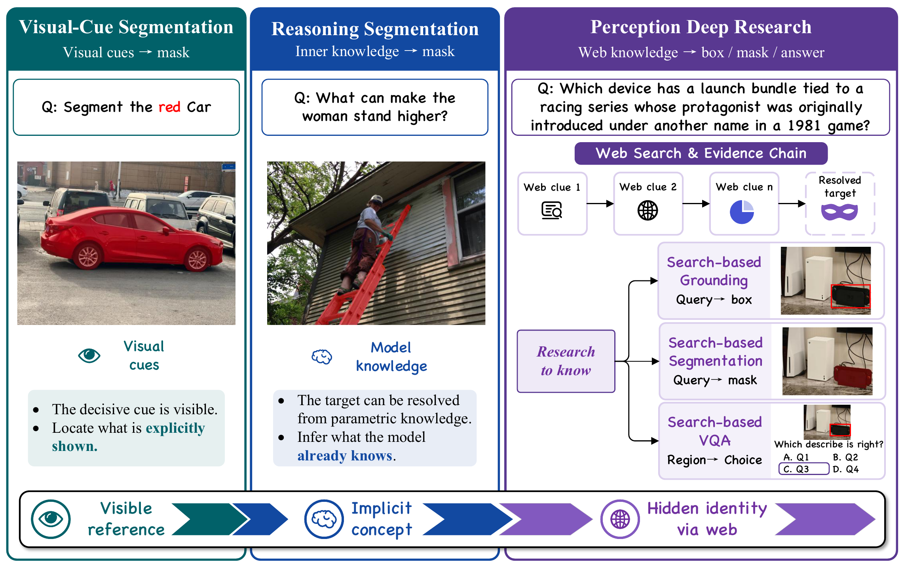

<div align="center">

## 🔎 Pixel-Searcher: Bringing Agentic Search into Visual Perception


<p>
  <a href="https://arxiv.org/abs/2605.12497">📄 Paper</a> 
  <a href="https://huggingface.co/datasets/yangbokang81/WebEyes">🤗 Dataset</a> 
  <a href="https://pixel-searcher.github.io/">🌐 Website</a> 
</p>

</div>


This repository contains the open-source evaluation code and reference implementation for **Pixel-Searcher** on the **WebEyes** benchmark. WebEyes evaluates search-based visual reasoning across three datasets: WebEyes-Seg, WebEyes-Ground, and WebEyes-VQA.

<p align="center">
  
</p>


## 🧩 Tasks

| Task | Input | Output |
| --- | --- | --- |
| **WebEyes-Ground** | Image + knowledge-intensive query | Bounding box |
| **WebEyes-Seg** | Image + knowledge-intensive query | Binary mask |
| **WebEyes-VQA** | Image + target box + answer options | Option index |

## 📦 Dataset

The WebEyes dataset is available on [Hugging Face](https://huggingface.co/datasets/yangbokang81/WebEyes).

Download with Hugging Face Hub:

```bash
pip install -U huggingface_hub
hf download yangbokang81/WebEyes --repo-type dataset --local-dir ./dataset
```


## 📊 Evaluation

See [eval/README.md](eval/README.md) for prediction formats, metrics, and
LISA-style mask evaluation.

Run OpenAI-compatible model inference and evaluate grounding and VQA :

```bash
python eval/infer.py --env-file eval/.env --dataset-root ./dataset --task all --limit 10
python eval/infer.py --env-file eval/.env --dataset-root ./dataset --task grounding --limit 10
```


## 🧭 Our Method

Set up runtime variables:

```bash
cd method
cp .env.example .env
```

Run a small grounding or VQA job:

```bash
python run_benchmark.py --task grounding --limit 10
python run_benchmark.py --task choice --limit 10
```

See [method/README.md](method/README.md) for configuration, dataset paths,
outputs, and OpenAI-compatible API usage.

## 📚 Citation

If you use Pixel-Searcher or WebEyes, please cite:

```bibtex
@misc{yang2026webpixelsbringingagentic,
      title={From Web to Pixels: Bringing Agentic Search into Visual Perception}, 
      author={Bokang Yang and Xinyi Sun and Kaituo Feng and Xingping Dong and Dongming Wu and Xiangyu Yue},
      year={2026},
      eprint={2605.12497},
      archivePrefix={arXiv},
      primaryClass={cs.CV},
      url={https://arxiv.org/abs/2605.12497}, 
}
```
